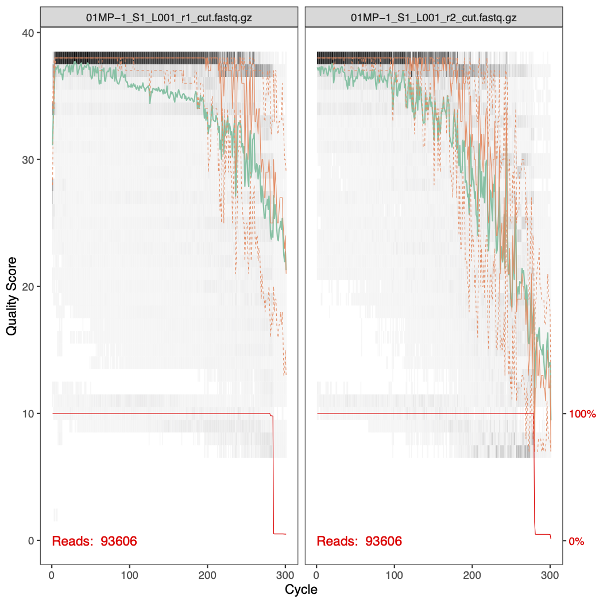
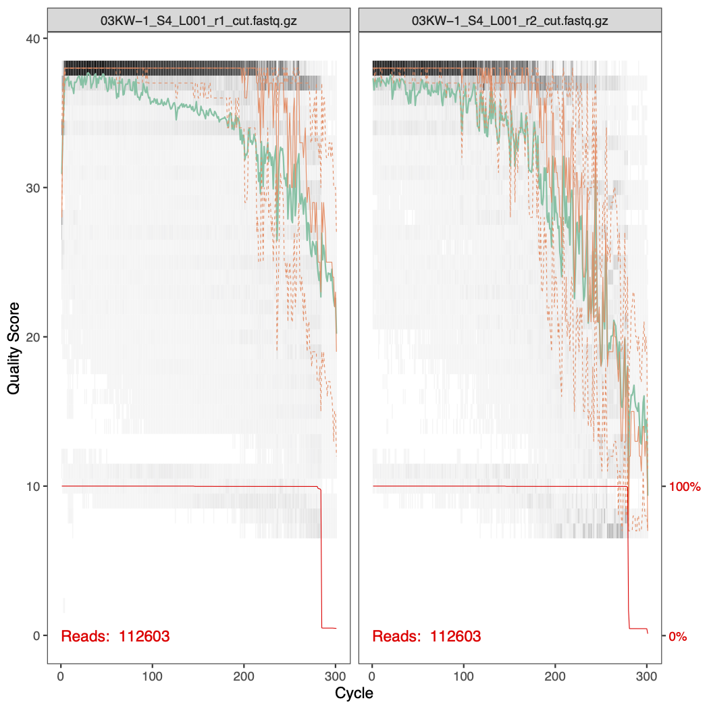
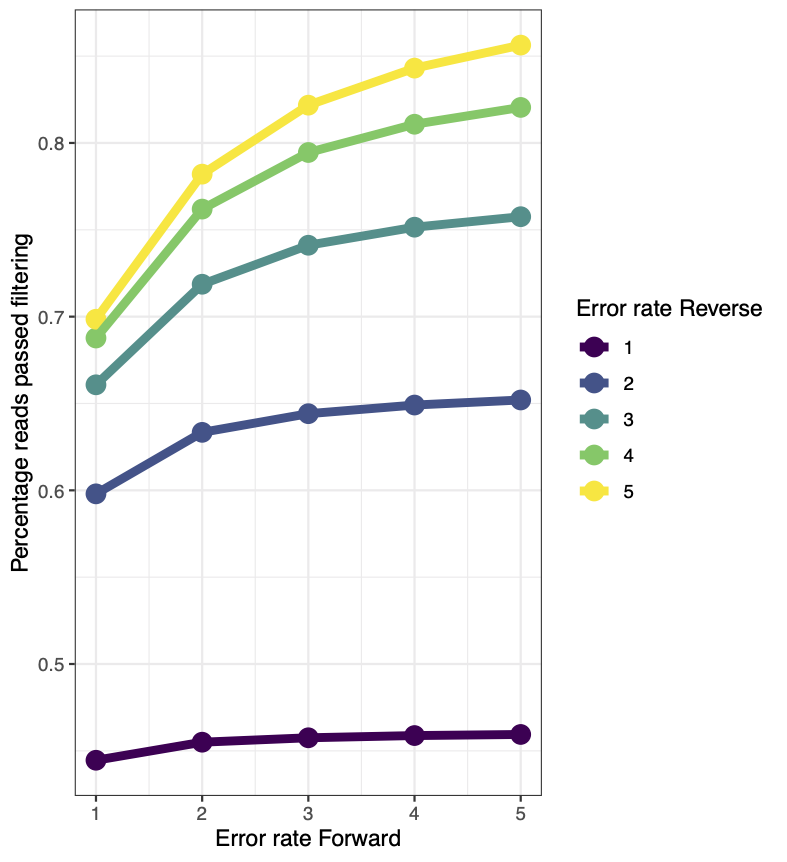
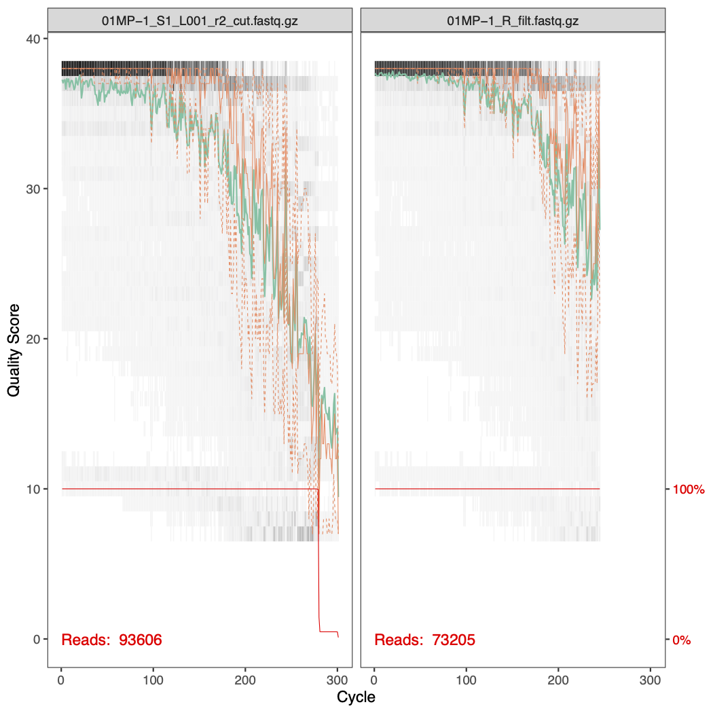

# Project

## Setup

Please download the raw data [here](https://www.dropbox.com/s/7sd7ipsswqcjxxj/raw_data.zip?dl=0). 

These samples are from a study looking at the effect of a prebiotic on the gut microbiota of children with type 1 diabetes. To invesigate this, the researchers took samples at three timepoints (baseline, 3 months, and 6 months) and sequenced the **V3-V4** region of the 16S rRNA gene. 

## Task 1

The first step with all sequence data is to ensure the primers have been removed. The two most common tools to accomplish this are **Cutadapt** and **Trimmomatic**. 

Note: both of these tools can be used for quality trimming as well as primer removal but here we will perform the quality trimming in dada2 instead. 

### Cutadapt

You can find the documentation for this tool [here](https://cutadapt.readthedocs.io/en/stable/).

These are the parameters that contain the primer sequences:

- `-g : forward primer`
- `-G : reverse primer`
- `-a : reverse primer, reverse complement`
- `-A : forward primer, reverse complement` 

For this dataset, these are the appropriate primers:

```
-g TCGTCGGCAGCGTCAGATGTGTATAAGAGACAGCCTACGGGNGGCWGCAG
-G GTCTCGTGGGCTCGGAGATGTGTATAAGAGACAGGACTACHVGGGTATCTAATCC
-a GGATTAGATACCCBDGTAGTCCTGTCTCTTATACACATCTCCGAGCCCACGAGAC
-A CTGCWGCCNCCCGTAGGCTGTCTCTTATACACATCTGACGCTGCCGACGA
```

Here is an example of how to execute Cutadapt from the command line:

```
cutadapt -g <sequence> -G <sequence> -a <sequence> -A <sequence> -o output_forward.fastq -p output_reverse.fastq input_forward.fastq input_reverse.fastq
```

Note that you can also run cutadapt from within R. You can find instructions on how to do that [here](https://benjjneb.github.io/dada2/ITS_workflow.html).

### Trimmomatic

You can find the documentation for this tool [here](http://www.usadellab.org/cms/?page=trimmomatic). 

Instead of specifying forward and reverse reads, Trimmomatic takes a fasta file as input and searches the reads for all sequences in the files. When using Trimmomatic on paired-end reads, you will get four output files: forward and reverse reads that are still paired (reads for which both forward and reverse were kept) and forward and reverse reads that are unpaired. In general, the number of unpaired reads should be small and you can continue with your analysis without these.

For this dataset, you can use [this fasta](https://www.dropbox.com/s/wc2kihxfep23ycw/v3v4primers.fa?dl=0).

Here is an example of how to execute Trimmomatic from the command line:

```
trimmomatic PE input_forward.fq.gz input_reverse.fq.gz output_forward_paired.fq.gz output_forward_unpaired.fq.gz output_reverse_paired.fq.gz output_reverse_unpaired.fq.gz ILLUMINACLIP:v3v4primers.fa:2:30:10:2:keepBothReads LEADING:0 TRAILING:0 MINLEN:0
```

### Primers removed

If you don't care about using either of these tools and want to move on to the next step, you can find the sequences with the primers removed [here](https://www.dropbox.com/s/qrf24anx9zllp9t/trimmed_data.zip?dl=0).

## Task 2

Use the dada2 pipeline to generate a table of ASVs and a taxonomy table. 

1. Plot quality profiles of the reads for all samples. Save these as pdf files.
2. Try a couple of sets of filtering params and determine the best choice.
3. Filter and trim the data and generate the quality plots again. Save these as well.
4. Learn the error rates and visually inspect the estimated error rates.
5. Infer samples. 
6. Merge paired reads.
7. Construct sequence table.
8. Remove chimeras.
9. Track reads through the pipeline and ensure that no step of the analysis removed a large/unreasonable proportion of the reads.
10. Assign taxonomy using the Silva databse. 
11. Save the ASV table and taxonomy table using the `saveRDS()` function. 

## Task 3

Use the phyloseq package to generate do some basic analysis. For this section you will need the [metadata](https://www.dropbox.com/s/htomvrgruy7am7a/project_metadata.txt?dl=0).

1. Generate a histogram of the number of reads per sample. Does this look okay?
2. Generate a table of alpha diversity measures (Shannon, Simspon, and Chao1) and use this table to plot alpha diversity by treatment and timepoint.
3. Transform the data to relative abundances and remove ASVs that are only present in less than 5% of the samples. 
4. Perform a principal component analysis (PCoA) using the `ordinate()` function and `distance = "bray"`. Plot beta diversity.
5. Explore the composition of each sample by generating bar plots of the relative abundances at the level of phylum, family, and genus. For family and genus, plot only the top 10 most abundant taxa. 

## Project solutions

### Task 2 - dada2

For this section, the solution closely resembles the code from the [dada2 tutorial](http://benjjneb.github.io/dada2/tutorial.html). The main challenge is to determine the appropriate filtering parameters. 

Here are the quality profiles for the forward and reverse reads for samples 01MP-1 and 03KW-1. You can see that the quality of the ends of the reverse reads are much worse than the forward reads.




To help guide our parameter choice, here is a plot showing the percentage of reads that passed filtering as a produce of changing both the forward error rate and the reverse error rate. 

```{r, echo = F}
library(knitr)

```

Based on this, we should choose an error rate of `c(3,4)` or something similar. Note that the truncation length used here was `c(265,245)`.

After filtering, we look the effect of the filtering on the quality profiles. Below are the before and after filtering quality profiles of the forward and reverse reads of sample 01MP-1. 



 
### Task 3 - phyloseq

```{r, echo = F, message = F}
library(phyloseq)
library(tidyverse)
```

Following the dada2 pipeline, we will have a sequence table and a taxonomy table. 

```{r}
path <- "./book/project_files/"

# Read in files
seqtab <- readRDS(file.path(path, "seqtab.rds"))
taxa <- readRDS(file.path(path, "taxa.rds"))
info <- read.table(file.path(path, "project_metadata.txt"), header = TRUE)

# Match sample names
rownames(info) <- rownames(seqtab)

# Make a phyloseq object
ps <- phyloseq(otu_table(seqtab, taxa_are_rows=FALSE), sample_data(info), tax_table(taxa))

# Make timepoint a factor
sample_data(ps)$timepoint <- as.factor(sample_data(ps)$timepoint)

## Histogram of reads per sample
sums <- rowSums(otu_table(ps))
counts <- data.frame(as(sample_data(ps), "data.frame"), totalreads = sums)

qq <- ggplot(counts, aes(totalreads)) + geom_histogram(binwidth = 0.02) + ggtitle("Read counts per sample") + scale_x_log10()
qq

## Alpha diversity

## Make table of alpha diversity calculations
alpha <- estimate_richness(ps, measures = c("Chao1", "Shannon", "Simpson"))
alpha_info <- sample_data(ps)
aa <- cbind(alpha, alpha_info)


a0 <- ggplot(aa, aes(x = treatment, y = Shannon, fill = timepoint)) +
  geom_boxplot(outlier.fill = NULL, outlier.shape = 21) +
  theme_bw() +
  geom_point(position = position_dodge(width = 0.75))
a0

## Beta diversity

# transform to relative abundace
rel <- transform_sample_counts(ps, function(x) x / sum(x))
# filter out low prevalence ASVs
prevdf <- apply(X = otu_table(ps), MARGIN = ifelse(taxa_are_rows(ps), yes = 1, no = 2), FUN = function(x){sum(x > 0)})
prevdf <- data.frame(prevalence = prevdf, total_abundance = taxa_sums(ps), tax_table(ps))
prevalence_threshold <- 0.05 * nsamples(ps)
keeptaxa <- rownames(prevdf)[prevdf$prevalence >= prevalence_threshold]
relf <- prune_taxa(keeptaxa, rel)
psf <- prune_taxa(keeptaxa, ps)

ord <- ordinate(relf, method = "PCoA", distance = "bray")
b0 <- plot_ordination(relf, ord, shape = "treatment", color = "timepoint") +
  theme_bw()
b0

## Composition

# Agglomerate to phylum, family, and genus level
phy <- tax_glom(relf, "Phylum")
fam <- tax_glom(relf, "Family")
gen <- tax_glom(relf, "Genus")

phymelt <- psmelt(phy)
c0 <- ggplot(phymelt, aes(sample_id, Abundance, fill = Phylum)) +
  geom_bar(stat = "identity") +
  theme_bw() +
  facet_wrap(~treatment, scales = "free_x")
c0

top10 <- names(sort(taxa_sums(fam), TRUE))[1:10]
fam10 <- prune_taxa(top10, fam)
fammelt <- psmelt(fam10)
c1 <- ggplot(fammelt, aes(sample_id, Abundance, fill = Family)) +
  geom_bar(stat = "identity") +
  theme_bw() +
  facet_wrap(~treatment, scales = "free_x")
c1

top10 <- names(sort(taxa_sums(gen), TRUE))[1:10]
gen10 <- prune_taxa(top10, gen)
genmelt <- psmelt(gen10)
c2 <- ggplot(genmelt, aes(sample_id, Abundance, fill = Genus)) +
  geom_bar(stat = "identity") +
  theme_bw() +
  facet_wrap(~treatment, scales = "free_x")
c2

```

